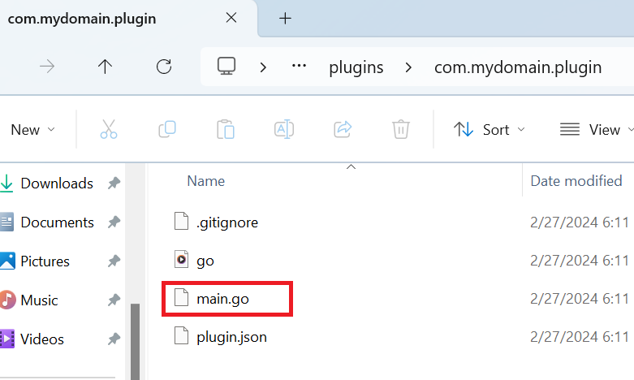

# Creating a Plugin

## The create-plugin command

To create a new plugin, open a terminal and navigate inside the devkit directory.

If you are using Windows, type:
```cmd
.\bin\flare.exe create-plugin
```

If you are using Linux or Mac, type:
```sh
./bin/flare create-plugin
```

## Plugin Details

Follow the instructions in the command prompt and enter the necessary details for your plugin. Below are the needed details for your plugin:

### Package Name
This is the primary identifier of your plugin. It should be unique and follow reverse domain naming convention, e.g `com.your-domain.your-plugin`. The package name should be in lowercase and should not contain any special characters or spaces except period, underscore and hyphen (`.`, `_`, `-`).

### Plugin Name
This is the name of your plugin, e.g. "System Monitor".

### Description
This is a brief description of your plugin. It should describe the purpose of your plugin.

## The main.go file

After that, your plugin will be created inside the `plugins` directory. Inside your plugin directory, you will find a `main.go` file.



This file contains `Init` function which will be called when your plugin gets loaded into the system. Below is the initial content of `main.go` file:

```go title="main.go"

package main

import (
	"net/http"

	sdkplugin "github.com/flarehotspot/sdk/api/plugin"
)

func main() {}

func Init(api sdkplugin.PluginApi) {
    // Your code goes here...
}
```

!!! note
    The `api` variable is an instance of the [PluginApi](../api/plugin-api.md), the root API of the Flare Hotspot SDK. Throughout the documentation, when you see `api`, it refers to this variable.
