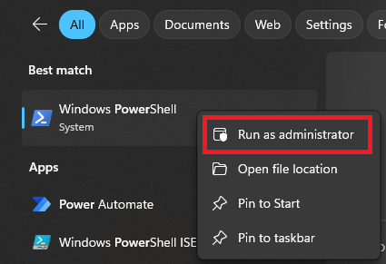
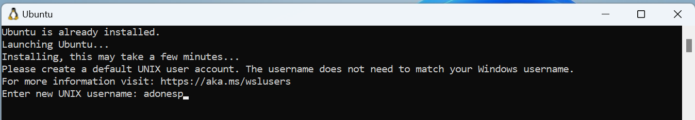
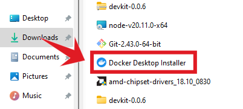

# Install Docker Desktop on Windows

This is a step-by-step guide on installing Docker Desktop for windows. If you are using linux, please refer to the [linux guide](https://docs.docker.com/desktop/install/ubuntu/).

## 1. Enable WSL 2 (Windows Subsystem for Linux)

To enabel WSL 2, open PowerShell as an administrator and run the following command:
```sh title="PowerShell"
wsl --install
```




!!! alert "Important"
    It is recommended to **restart your computer** after intalling WSL.

After rebooting, you will be asked to setup the Ubuntu account. Just enter your desired `username` and `password`. Then confirm your password.



## 2. Download docker installer

Open your browser and head to [docker download page](https://docs.docker.com/desktop/install/windows-install/). Then click the button to download the Docker Desktop installer.


## 3. Install Docker Desktop

Next, find the downloaded installer and double click to start the installation process.



## 4. Configuration

Once the installer opens up, make sure to check:
`Use WSL 2 instead of Hyper-V (recommended)`


Then click `OK` button to start the installation process.

## 5. Wait for the installation to complete


## 6. Update to new version

!!!warning "Important"
    It's important to update the Docker Desktop since we encountered a bug in the current version as of writing this article.


## 7. Restart Docker Desktop

After updating, restart Docker Desktop.

NOTE: This will only restart the Docker Desktop application, not your PC.


## 8. Download the Flare Hotspot SDK

After installing Docker Desktop, you can now proceed to [download the Flare Hotspot SDK](../getting-started.md/#2-download-flare-hotspot-sdk).
