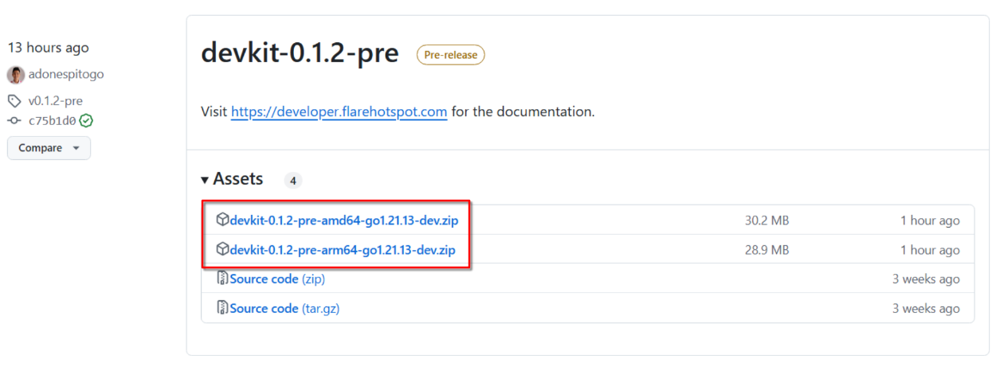
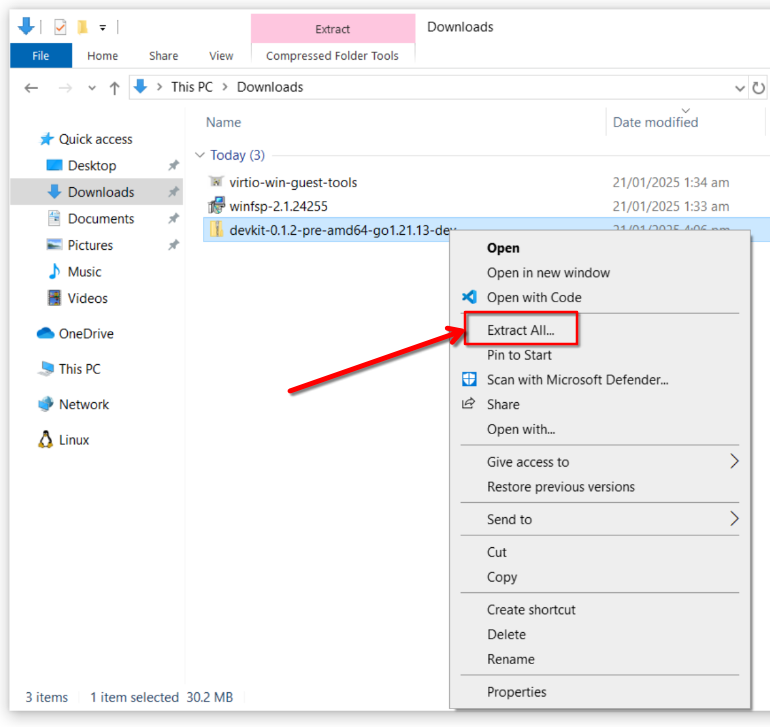
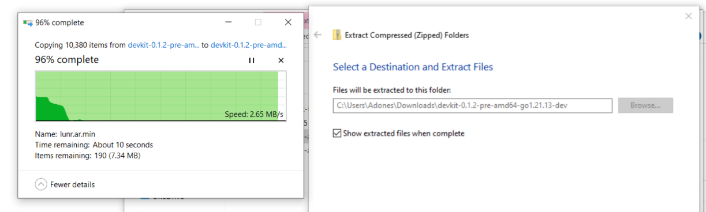
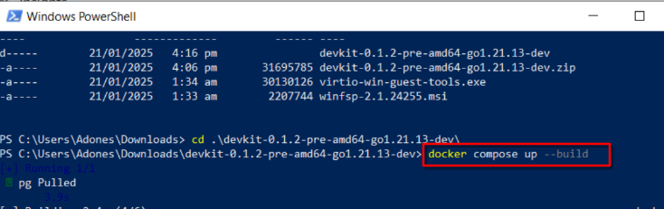
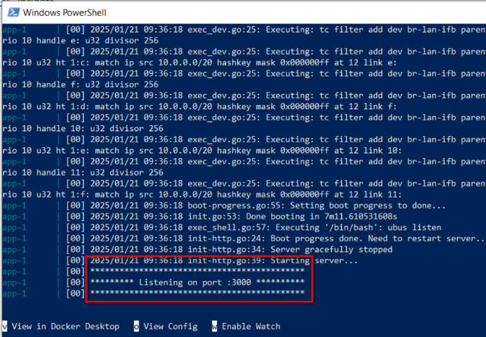

# Getting Started

## 1. Install Docker Desktop {#install-docker}

You can download docker from the official [docker website](https://docs.docker.com/desktop/) or follow our beginner-friendly tutorial for [windows](./install-docker-windows.md).

!!!note
    For Linux users, you can install Docker using the package manager of your distribution. For `Ubuntu` users, you can follow [these instructions](https://docs.docker.com/engine/install/ubuntu/).

## 2. Download the SDK {#download-sdk}

Download the latest **devkit-x.x.xzip** file from [devkit releases](https://github.com/flarehotspot/devkit/releases) repository.
Instructions for downloading the SDK:

- If you are using Windows on x86/64 CPU architecture (non-arm CPU), choose the file with **amd64** in the file name.
- If you are using Windows on Arm or Mac OS on M-series CPU, choose the file with **arm64** in the file name.

```url title="Browser"
https://github.com/flarehotspot/devkit/releases
```



After downloading, extract the zip file to your desired location.






## 3. Starting The SDK {#start-sdk}

To start the SDK runtime, open windows `CMD` or `PowerShell` and navigate to the extracted file's root directory then run:
```sh title="PowerShell"
docker compose up --build
```



For [VSCode](https://code.visualstudio.com/) users, you can also do this in the `vscode` terminal.

Docker may take sometime to download and install the container and its dependencies. Wait for the message `Listening on port :3000` which indicates that the server is already running and ready to accept connections.



Now you can access the Flare Hotspot web interface:

- Captive Portal: [http://localhost:3000](http://localhost:3000)
- Admin Dashboard: [http://localhost:3000/admin](http://localhost:3000/admin)
    - username: `admin`
    - password: `admin`
- Database Management: [http://localhost:3001](http://localhost:3001)
- Documentation: [http://localhost:3002](http://localhost:3002)

The server will automatically recompile and restart when you make changes to any of the plugins. You have to refresh the browser to see the changes.

## 4. Upgrading The SDK {#upgrade-sdk}

To upgrade the SDK, download the latest release from the [devkit releases page](https://github.com/flarehotspot/devkit/releases) and extract the contents to your desired destination. Then copy your plugin directory into the `plugins` directory inside the new SDK. Make sure to stop the previous SDK runtime then [start](#start-sdk) the new SDK runtime.

