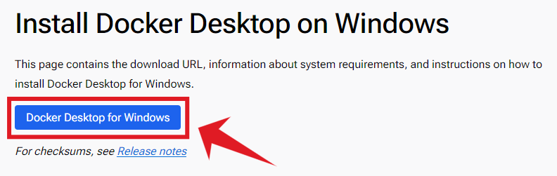
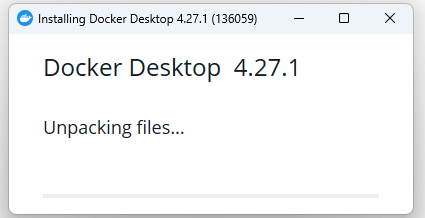
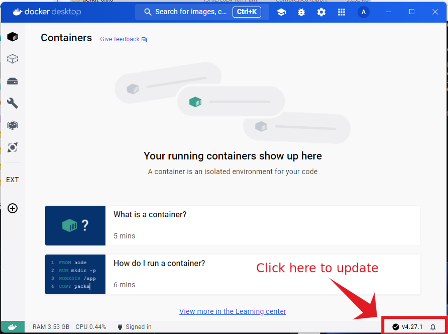

# Install Docker Desktop on Windows

This is a step-by-step guide on installing Docker Desktop for windows. If you are using linux, please refer to the [linux guide](https://docs.docker.com/desktop/install/ubuntu/).

## 1. Enable WSL 2 (Windows Subsystem for Linux) {#enable-swl}

Make sure to [enable WSL](https://learn.microsoft.com/en-us/windows/wsl/install) on Windows. To enable `WSL` on windows, run `PowerShell` as Administrator and type:
```sh title="PowerShell"
wsl --shutdown
wsl --update
wsl --install
```


If you encounter an error while installing `WSL` on Windows, try to unregister the default distribution and install it again with:

```sh
wsl --unregister ubuntu
wsl --install
```


!!! alert "Important"
    It is recommended to **restart your computer** after intalling WSL.

After restarting your computer, you will be asked to setup the Ubuntu account. Just enter your desired `username` and `password`. Then confirm your password.


## 2. Download docker installer {#download-docker}

Open your browser and head to [docker download page](https://docs.docker.com/desktop/install/windows-install/). Then click the button to download the Docker Desktop installer.



## 3. Install Docker Desktop {#install-docker-desktop}

Next, find the downloaded installer and double click to start the installation process.


## 4. Configuration {#configuration}

Once the installer opens up, make sure to check:
`Use WSL 2 instead of Hyper-V (recommended)`


Then click `OK` button to start the installation process.

## 5. Wait for the installation to complete {#wait-for-installation}




## 6. Update to new version {#update-new-version}

!!!warning "Important"
    It's important to update the Docker Desktop since we encountered a bug in the current version as of writing this article.




## 7. Restart Docker Desktop {#restart-docker-desktop}

After updating, restart Docker Desktop.

NOTE: This will only restart the Docker Desktop application, not your PC.


## 8. Download the SDK {#download-sdk}

After installing Docker Desktop, you can now proceed to [download the Flare Hotspot SDK](./getting-started.md/#download-sdk).
